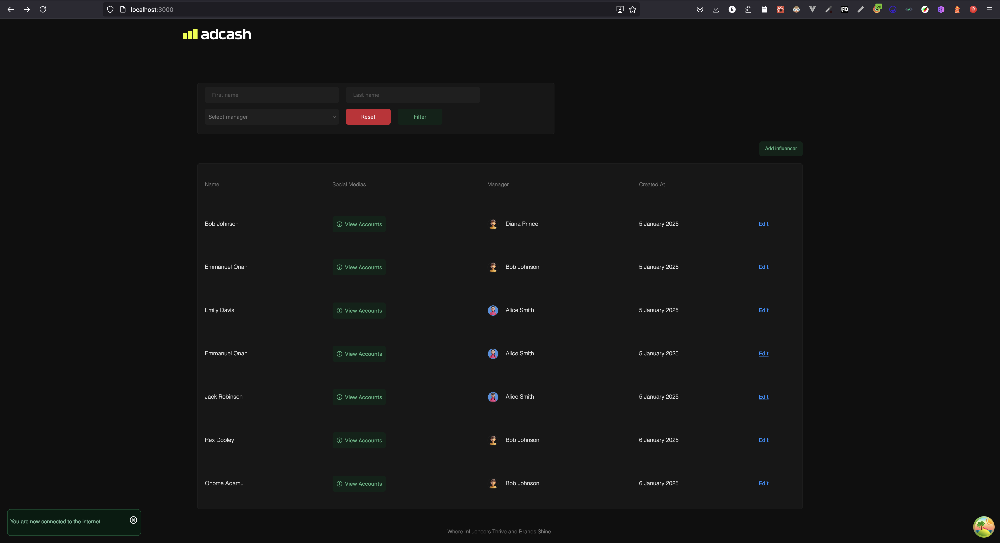
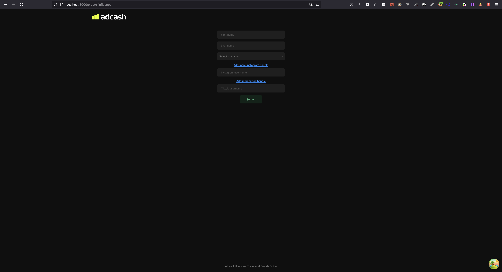
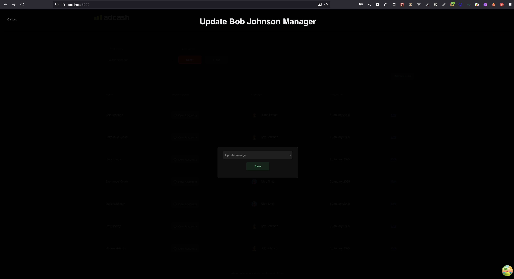

<div align="center">
  <a href="https://github.com/emmanuelonah/adcash-influencer-manager">
    
  </a>
</div>

<h1 align="left" style="font-size:40px;">Adcash influencer manager</h1>

This is an influencers management system.

* [Client App 🎨](./client/README.md)
* [Server App 📦](./server/README.md)

## Get started

### Step 1: Start the Backend server

ensure you have setup the env variables

```bash
cd server # check into the server directory

yarn run dev # up the server
```

### Step 2: Start the Frontend server

ensure you have setup the env variables

```bash
cd client # check into the client directory

yarn run dev # up the server
```

## Demo of the App





[App 👨‍🎨](https://adcash-influencer-manager.netlify.app/)

[API documentation 🤖](https://documenter.getpostman.com/view/7240396/2sAYJ9BJpz#d95807cc-bb9a-41ad-ae05-9be7ebd86ee7)
